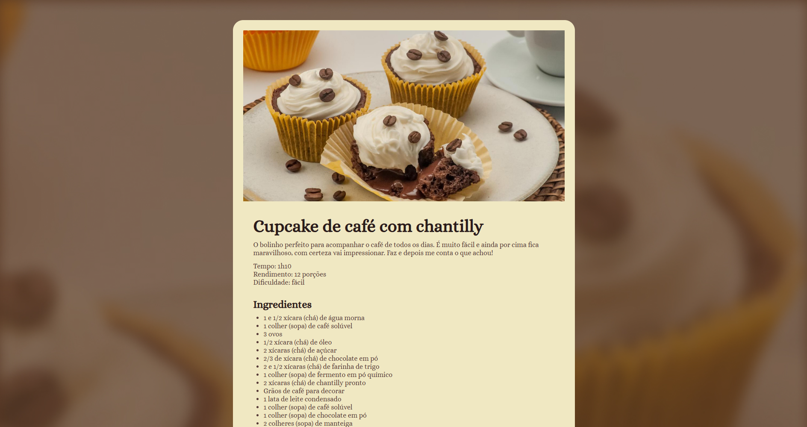

<h1 align="center">
    
</h1>
<p align="center">Recipe Page. Um aplicativo onde o estudo do estilo foi o foco principal, proporcionando uma página de receitas visualmente atraente e organizada.</p>
<p align="center">
 <a href="#sobre-o-projeto">Sobre o Projeto</a> |
 <a href="#tecnologias">Tecnologias</a> |
 <a href="#iniciando-o-projeto">Iniciando o projeto</a> |
 <a href="#licença">Licença</a> |
 <a href="#autor">Autor</a> 
</p>

### Sobre o Projeto

Recipe Page é uma aplicação simples focada no estudo e aplicação de estilos com HTML e CSS. O objetivo principal foi criar uma página de receitas organizada, responsiva e visualmente atrativa, destacando boas práticas de design e estruturação de layout.

---

### Tecnologias

- [HTML5](https://developer.mozilla.org/en-US/docs/Web/Guide/HTML/HTML5) - Linguagem de marcação utilizada para estruturar a página
- [CSS3](https://developer.mozilla.org/en-US/docs/Web/CSS) - Folhas de estilo em cascata utilizadas para estilizar a página

---

### Como Começar

```bash
# Clone o aplicativo
$ git clone https://github.com/sillasemanoel/recipe-page

# Navegue até o diretório do aplicativo
$ cd recipe-page

# Abra o arquivo index.html no seu navegador
$ index.html
```

---

### Licença

Distribuído sob a Licença MIT. Veja [LICENSE](LICENSE) para mais informações.

---

### Autor

Feito por Sillas Emanoel 👋🏽
